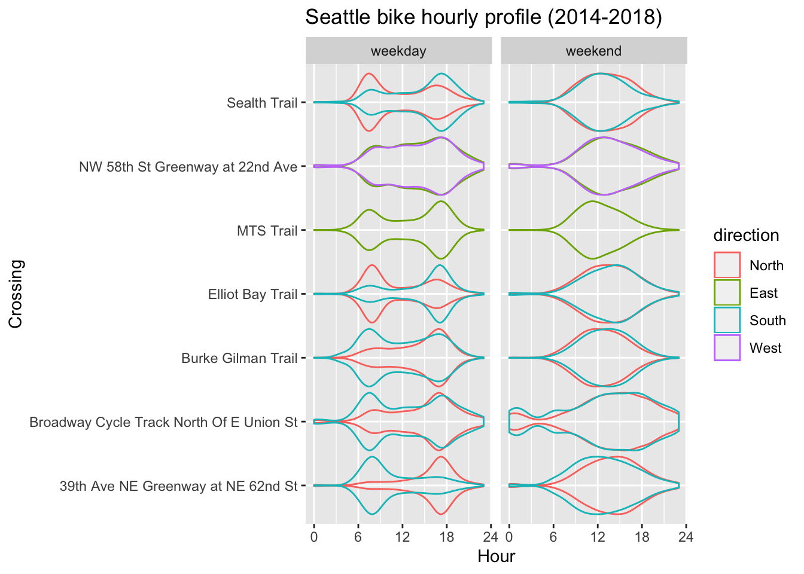

TidyTuesday
================

My contributions to the [TidyTuesday
challenge](https://github.com/rfordatascience/tidytuesday).

-----

### Squirrel Census by [Squirrel Census](https://data.cityofnewyork.us/Environment/2018-Central-Park-Squirrel-Census-Squirrel-Data/vfnx-vebw)

on
going…

### Seattle Bike by [seattle.gov](https://www.seattletimes.com/seattle-news/transportation/what-we-can-learn-from-seattles-bike-counter-data/)

